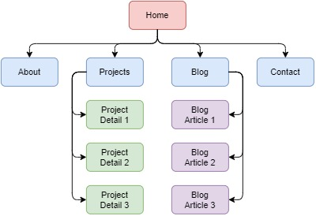

# JihyungKim_T1A2

**Quick Summary**

- Live portfolio website: https://jihyungkim.netlify.app.com
- Github repository: https://github.com/jkim333/T1A2-Portfolio

 

**Table of Contents**

1. [Purpose](#purpose)
1. [Functionality / features](#functionality)
1. [Sitemap](#sitemap)
1. [Screenshots](#screenshots)
1. [Target audience](#target_audience)
1. [Tech stack](#tech_stack)

 

<h2 id="purpose">Purpose</h2>

This portfolio website was developed to present myself to future employers and recruiters. The website contains a lot of information about myself, particularly my technical skills, description of projects that I have worked on, and my personality interests.

I aim to connect with employers and recruiters using this portfolio website.

 

<h2 id="functionality">Functionality / features</h2>

This portfolio website provides a lot of information about myself, such as my technical skills, blog posts, and past projects that I have worked on. It also provides a downloadable link to a PDF of my resume, and a contact form which can be submitted by a user to reach out to me via email.

This website is fully responsive and is tailored to all available displays, including desktop, mobile and tablet.

Moreover, semantic HTML elements were added to provide meaning to the elements and improve accessiblity support for all users.

 

<h2 id="sitemap">Sitemap</h2>

All visitors to the website will firstly be directed to the 'Home' page as this is the index page. The 'Home' page provides links to 'About', 'Projects', 'Blog', and 'Contact' pages. This page will also provide a short snapshot and a link to the aforementioned pages. The description of each page is shown below:

- 'About' page provides an overall introduction of myself, my technical skills, education background, work experience, and my personal interests. 'About' page also provides a downloadable link to a PDF of my resume.
- 'Projects' page provides a list of my projects that I have worked on to date. Each project is provided with a link that leads users to 'Project Detail' page.
- 'Blog' page provides a list of blogs that I have written. Each blog post is provided with a link that leads users to 'Blog Detail' page.
- 'Contact' page provides a form for users to fill in to reach out to me via an email.

 

<h2 id="screenshots">Screenshots</h2>

screenshots...

 

<h2 id="target_audience">Target audience</h2>

The target audience of my portfolio are:

- Employer looking to engage a developer
- Recruiter looking to engage a developer
- Clients looking to engage a developer to create a new website or a new web application for their business
- Fellow developers looking to understand my technical capabilities

 

<h2 id="tech_stack">Tech stack</h2>

The technology used for the development of this portfolio project are listed below:

- HTML5
- CSS3
- JavaScript
- Git
- GitHub
- Netlify (used as a deployment platform)
